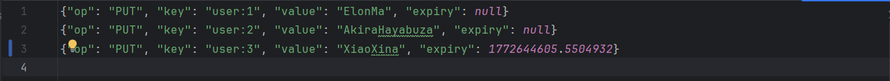
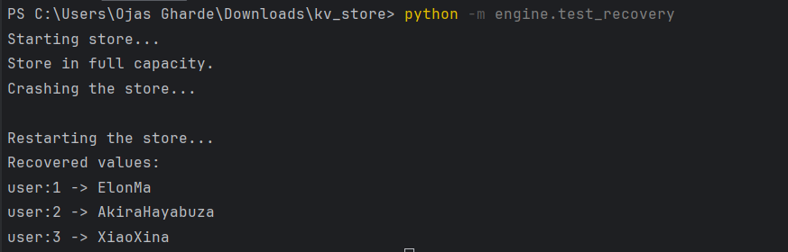
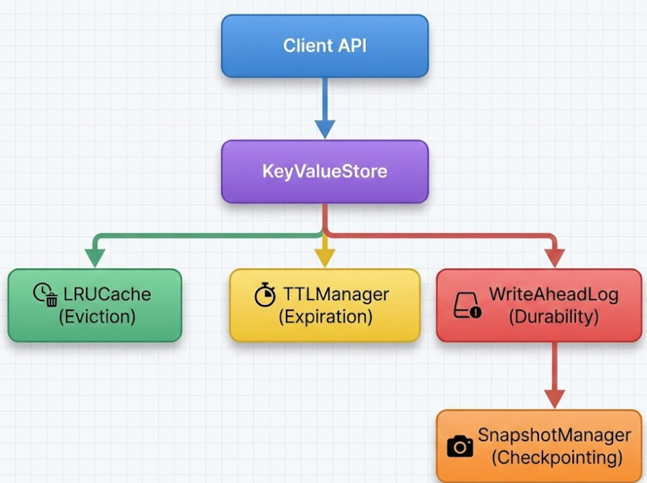
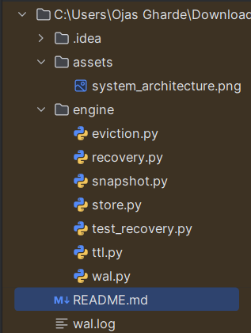

🚀 Fault-Tolerant Key-Value Store
Redis-Inspired Durable In-Memory Storage Engine (Python)

A production-style, single-node, fault-tolerant key-value store built from scratch to demonstrate core distributed systems and storage engine principles.

This project implements durability, crash recovery, TTL-based expiration, bounded memory eviction, and snapshotting — combining high-performance in-memory access with persistent guarantees.

🔥 Live Crash Recovery Demonstration
WAL Before Crash

Simulated Crash + Restart
python -m engine.test_recovery

Output:

📌 Motivation

Modern storage engines like Redis, RocksDB, and Kafka rely on:

Write-Ahead Logging (WAL)

Snapshotting / Checkpointing

Lazy Expiration

Eviction Policies

Crash Recovery Mechanisms

This project rebuilds those core ideas from first principles to deeply understand:

Durability vs performance tradeoffs

Memory-bounded system design

Deterministic crash recovery

Data lifecycle management

Clean separation of storage concerns

🏗 System Architecture

                 

🧠 Core Design Decisions

1️⃣ In-Memory Storage Model

The primary store is:

dict[key] = (value, expiry_timestamp)

This guarantees:

O(1) key lookups

O(1) updates

Constant-time deletion

All durability and eviction logic operates around this structure.

2️⃣ Bounded Memory via LRU Eviction

The store supports fixed capacity.

When capacity is exceeded:

The Least Recently Used (LRU) key is evicted.

Eviction is deterministic.

The eviction is logged in WAL to maintain durability.

This ensures:

Memory never exceeds configured bounds.

Hot keys remain resident.

Cold keys are removed predictably.

3️⃣ TTL-Based Expiration

Keys may optionally include a TTL:

store.put("user:1", "Elon", ttl=10)
Expiry Model

TTL is converted to an absolute timestamp:

expiry = time.time() + ttl

Keys without TTL:

expiry = None
Expiration Strategy: Lazy Deletion

The store does NOT scan memory every second.

Instead:

Expiration is checked during get()

Expired keys are deleted on access

Optional future improvement: background cleaner

This mirrors real-world systems like Redis for performance efficiency.

4️⃣ Write-Ahead Logging (WAL)

Every mutation is logged before being applied in-memory.

Why WAL?

If a crash occurs:

Memory is lost.

WAL persists on disk.

Recovery replays WAL to rebuild state.

WAL Format (JSON per line)

Example:

{"op": "PUT", "key": "user:1", "value": "Ojas", "expiry": 1708901244.56}
{"op": "DELETE", "key": "user:1"}
Properties

Append-only

Line-delimited JSON

Flush + fsync on write

Durable before memory mutation

This guarantees:

No committed write is lost

Deterministic replay

Simplicity of parsing

5️⃣ Snapshotting (Checkpointing)

Snapshots capture full in-memory state periodically.

Why Snapshots?

Without snapshots:

Recovery time grows linearly with WAL size.

With snapshots:

Load snapshot (fast)

Replay only recent WAL entries

Recovery time remains bounded

Snapshot includes:

Keys

Values

Expiry timestamps

🔁 Crash Recovery Flow

On restart:

1. Initialize empty store
2. Load snapshot (if exists)
3. Replay WAL entries in order
4. Skip expired keys
5. Restore LRU order
Guarantees

Crash-safe durability

Expired keys not resurrected

Deterministic final state

No duplicate reprocessing

🛠 Example Usage
from engine.store import KeyValueStore

store = KeyValueStore(
    capacity=3,
    wal_path="wal.log",
    snapshot_path="snapshot.json"
)

store.put("user:1", "ElonMa")
store.put("user:2", "Akira", ttl=5)

print(store.get("user:1"))

store.create_snapshot()
store.close()

Recovery:

store = KeyValueStore(
    capacity=3,
    wal_path="wal.log",
    snapshot_path="snapshot.json"
)

store.recover()

🧪 Crash Simulation

The project includes a recovery test:

python -m engine.test_recovery

Simulates:

Writing keys

Forced shutdown

Restart

Full WAL replay

Data verification

⚙️ Reliability Principles Demonstrated

Write-before-apply durability

Idempotent replay logic

Bounded memory enforcement

Separation of storage layers

Lazy expiration for performance

Snapshot + WAL hybrid recovery

🔬 Engineering Tradeoffs
Design Choice	Tradeoff
Lazy TTL	Faster writes, delayed cleanup
Append-only WAL	Larger disk usage, simpler recovery
JSON WAL	Human-readable, slightly larger size
Single-node design	Simpler consistency model
🚀 Future Enhancements

Background TTL cleanup thread

WAL compaction after snapshot

Concurrent access (thread-safe store)

Multi-node replication

Strong vs eventual consistency modes

Benchmark suite (throughput & latency)

Disk-backed storage layer

🧠 What This Project Demonstrates

Storage engine fundamentals

Crash consistency modeling

Memory-bounded data structure design

Systems-level engineering thinking

Clean modular architecture

Real-world distributed systems concepts

This project rebuilds core ideas used in:

Redis

Kafka

RocksDB

Log-structured storage engines

📁 Project Structure

